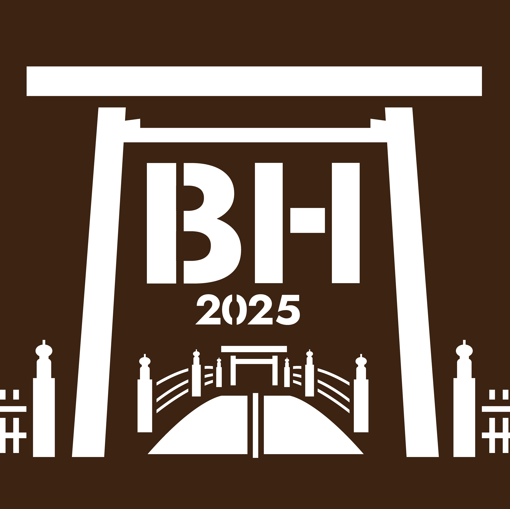

# DBCLS BioHackathon 2025

## Objectives

The BioHackathon in Japan, organized by the Database Center for Life Science (DBCLS), continues to prioritize the integrated use of databases in the life sciences, with a strong emphasis on interoperability, standardization, and the construction of FAIR knowledge graphs. In recent years, the development of tools and workflows for integrating heterogeneous biological and biomedical data—including multi-omics, imaging, clinical, and environmental data—has become increasingly central. This integration is key to enabling cross-domain analysis and improving reproducibility in data-driven research.

In addition, the rapid progress of large language models (LLMs) and other generative AI technologies opens new opportunities for extracting, linking, and reasoning over life science data. We aim to explore how these technologies can be effectively combined with curated databases and ontologies to enhance knowledge discovery, support hypothesis generation, and streamline research workflows. Through collaborative, hands-on hacking, the BioHackathon seeks to incubate innovative ideas and open solutions that push the boundaries of computational life science.

## Dates and venue

- Dates: 14th September (Sun) - 20th September (Sat), 2025
- Venue: [VISON](https://vison.jp/) in Mie, Japan ([Google map](https://maps.app.goo.gl/JArqLrhYCCGfCfL78))

## Registration

-<s> Please register using the [registration form](https://docs.google.com/forms/d/e/1FAIpQLSd3a6TEnfatcH_C-aUZUmzf8jxXovEG5IVuD8ngdzm7j7xIPg/viewform?usp=sharing&ouid=111401176245823315613) </s>(Registration closed at July 31)

## Important dates

- July 1, 2025: Registration opens
- July 31, 2025: Registration closes; Deadline for accommodation fee payment
  - For international participants: Please make sure you can receive emails from @tcijapan.co.jp, as payment method details will be sent via that address.

Note: Registration may be closed early if the number of participants exceeds the venue capacity.

## Information

- [Schedule](https://github.com/dbcls/bh25/wiki/Schedule) (recently updated)
- [Participants](https://github.com/dbcls/bh25/wiki/Participants) (recently updated)
- [Projects](https://github.com/dbcls/bh25/wiki/Projects) (to be prepared)

## Organizers

- BioHackathon Management Organizaion, Database Center for Life Science

## Links

- [DBCLS](https://dbcls.rois.ac.jp/)
- [Past BioHackathons](http://biohackathon.org/)
- [BioHackathon Europe](https://biohackathon-europe.org/)
- [BioHackathon-MENA](https://github.com/biohackathon-mena)
- [BioHackathons in the US](https://biohackathons.github.io/)

<!--
## History of BioHackathon

A long time ago in a galaxy far, far away..

See [biohackathon.org](http://biohackathon.org/).
-->
